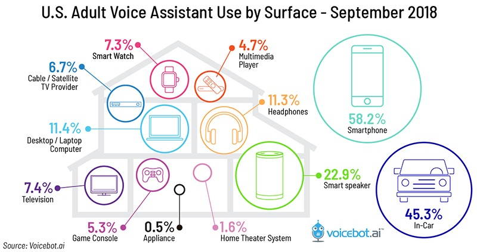
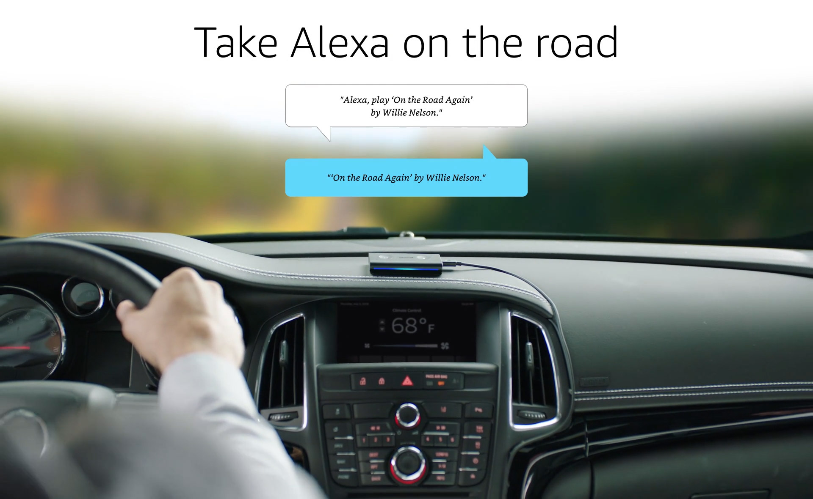

# NotifyArrival

* Dry Cleaning in the Car
* Getting Started
* Customer Experience
* FAQ
* Give Feedback

## Dry Cleaning in the Car

Does your business offers drive-thru pickup?  
What about "on my way" alerts so you can have their order ready when they arrive?  
Do you prep your customer's orders for pickup when they call to let you know they are on their way?

The biggest use-case for voice right now is in the car: 

> _"twice as many U.S. adults have used voice in the car and monthly active users are 60% higher...What we found was the car is firmly established as one of the big three voice assistant access points along with smartphones and smart speakers." -_ [voicebot.ai](https://voicebot.ai/2019/01/15/twice-the-number-of-u-s-adults-have-tried-in-car-voice-assistants-as-smart-speakers/)


This is a **premium** feature. Subscribe at voicedrycleaner.com/\#pricing 


Your customers have returned to **pick up their treasure**. They trusted you to clean and protect their most prized possessions. They left their home kingdom and are now headed to your kingdom of dry cleaning. They are riding caravans. Your kingdom is the last stop on their adventures before they return to their homes. Your customers are exhausted. They want a magical experience when picking up their newly cleaned treasures. 

Prepare for their arrival with fanfare!

You can welcome them by name! Have their order ready. Maybe even a little something special like a piece of candy for the kids. 

How do your customers tell you they are on their way? Their hands are busy driving so they can't open your website or mobile app. Do all of your customers have your phone number memorized to call to let you know? They won't be able to Google Search and drive. 

Amazon Alexa Auto is your Artificial Intelligence assistant for your business.

## Getting Started

### Free Members

NotifyArrival is **not available to free members** at this time. Your business can add NotifyArrival by subscribing to any of our paid pricing plans:

1. **Sign-Up** for a paid account [here](https://voicedrycleaner.com/#pricing)
2. Notify Arrival is **automatically available** to all of your customers!

### Startup Plan

For existing subscribers, NotifyArrival is **automatically added** to your business! You can get notified when your customers use Amazon Alexa so that when they say:

> "I am on my way"

Your business can receive:

1. SMS Notification
2. Email Notification
3. POS Integration

#### SMS Notification

You can add SMS Notifications by

1. visit your profile [here](https://voicedrycleaner.com/profile/)
2. click "Edit Details"
3. modify **"Phone Number"**
4. click "Save Changes"

#### Email Notification

You can add Email Notifications by

1. visit your profile [here](https://voicedrycleaner.com/profile/)
2. click "Edit Details"
3. modify **"Email for Order Confirmation"**
4. click "Save Changes"

#### POS Integration

Currently in **beta** only. We will update this page when POS Integration is made publicly available.

## Customer Experience

Creating a magical customer experience is one of our highest priorities. There is a slightly different process for returning customers for your Alexa Skill versus first-time users.

#### First-Time Users

1. Buy an[ Amazon Echo ](https://www.amazon.com/Introducing-Echo-Auto-first-your/dp/B0753K4CWG)or Open the [Amazon Shopping App](http://www.amazon.com/mobileapps)
2. _"Alexa, **enable** {my-dry-cleaner-name}"_
3. _"Alexa, tell {my-dry-cleaner-name} **I am on my way"**_

#### Returning Customers

Existing customers need to say:

> _**"Alexa, tell {my-dry-cleaner-name} I am on my way"**_
>
> _**"Alexa, tell {my-dry-cleaner-name} I am driving to your store"**_
>
> _**"Alexa, tell {my-dry-cleaner-name} I am coming to you"**_

## FAQ

## Give Feedback

You can leave feedback on this feature [here](https://voicefirstai.typeform.com/to/gcW8kp)

edit this page [here](https://github.com/VoiceFirstTech/voicefirsttech.com/edit/master/notifyarrival.md)

